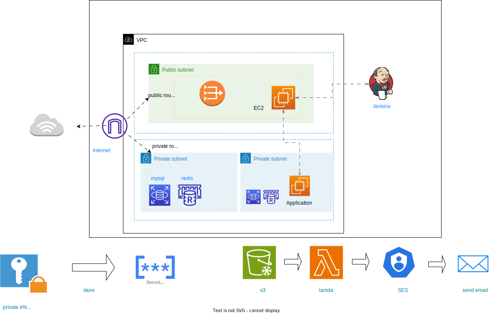

Deploying AWS Infrastructure with Terraform and Jenkins
====

----

## Overview
**Networking**
<ul>
<li>create vpc</li> 
<li>create internet gateway</li>  
<li>create public route table</li>  
<li> create private route table</li> 
<li> create public route</li> 
<li>  attach public route table to subnets</li>
</ul>

**Computing**
<ul>
<li>create security group which allow ssh from 0.0.0.0/0</li> 
<li>create security group that allow ssh and port 3000 from vpc cidr only</li>  
<li>create ec2(bastion) in public subnet with security group from 7 </li> 
<li> create ec2(application) private subnet with security group from 8</li>
<li>create two workspaces terraform and production</li> 
<li>create two variable definition files(.tfvars) for the two environments</li> 
<li>separate network resources into network module</li> 
<li>apply your code to create two environments one in us-east-1 and eu-central-1</li> 
<li>run local-exec provisioner to print the public_ip of bastion ec2</li>
<li> upload infrastructure code on github project</li>
<li>create jenkins image with terraform installed inside it</li> 
<li> create pipeline that takes env-param to apply terraform code on certain env</li> 
<li>verify your email in ses service</li>
<li>create lambda function to send email</li>  
<li>create trigger to detect changes in state file and send the email</li> 
</ul>

**Database**
<li>create rds</li>
<li>create elastic cache</li>  
<li> use jenkins to deploy node js app on the application ec2
</li> 

## Development

Configure your AWS access keys.

```bash
[default]
aws_access_key_id = <your_access_key_id>
aws_secret_access_key = <your_secret_access_key>
```


Create the 2 workspaces
```bash
$ terraform workspace new production
$ terraform workspace new terraform
```
Initialize working directory  to download the necessary Terraform plugins..

```bash
[default]
terraform init
```
 to create the Bastion host and security group run:

```bash
[default]
terraform apply
```


Once the Bastion host has been created, you can connect to it using SSH. The Bastion host will be assigned a public IP address, which you can use to connect to it from the public internet. For example:

```bash
ssh -i /path/to/private/key ec2-user@<bastion-public-ip>
```
Replace /path/to/private/key with the path to your private SSH key, and with the public IP address of the Bastion host.
## using jenkins

build the custom image that contains ansible and docker client 

```bash
cd jenkins
docker build -t <imageName> -f jenkins_master.dockerfile .

```
run the image
```bash
docker run --name <containerName> -p8080:8080 -d -v /var/run/docker.sock:/var/run/docker.sock  -v /usr/bin/terraform:/usr/bin/terraform <imageName>

```
for jenkins master at http://localhost:8080/

## Jenkins Pipeline Process

1- Add AWS Credentials to Jenkins

Navigate to "Manage Jenkins".
Select "Manage Credentials".
Add a new "AWS Credentials" entry with the necessary access key and secret key.

2- Create a Parameterized Pipeline

Go to "New Item".
Enter a name for your pipeline and select "Pipeline".
In the pipeline configuration, check "This project is parameterized".
Add a choice parameter named ACTION with options like apply and destroy.

3- Build the Infrastructure (Choose Apply)
In the pipeline script, include logic to handle the apply action using Terraform or any relevant tool.
Trigger the build and select "apply" when prompted.

4- Create a New Node
Navigate to "Manage Nodes and Clouds".
Click on "New Node".
Enter a name for the new node and select the appropriate node type (e.g., "Permanent Agent").
Configure the node settings, including remote root directory and launch method.


5- Create a New Pipeline for the Application
Go to "New Item" again.
Enter a name for the application pipeline and select "Pipeline".
Configure the pipeline as required, including SCM settings and build triggers.

6- Build the Pipeline Again and Choose Destroy
Trigger the application pipeline build.
When prompted, select "destroy" to tear down the infrastructure.
